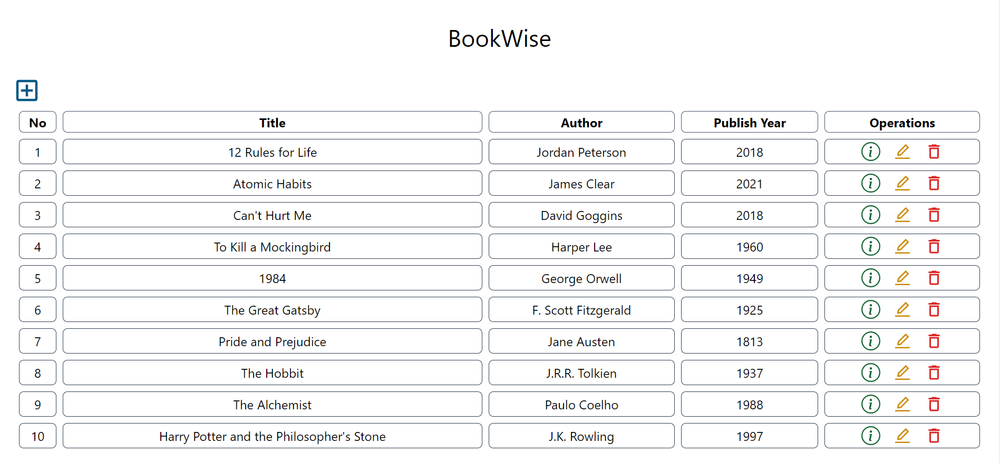
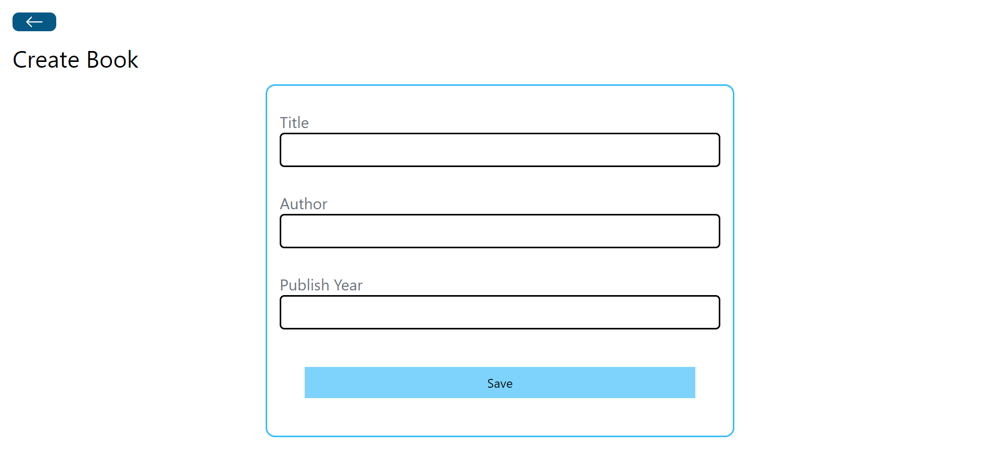
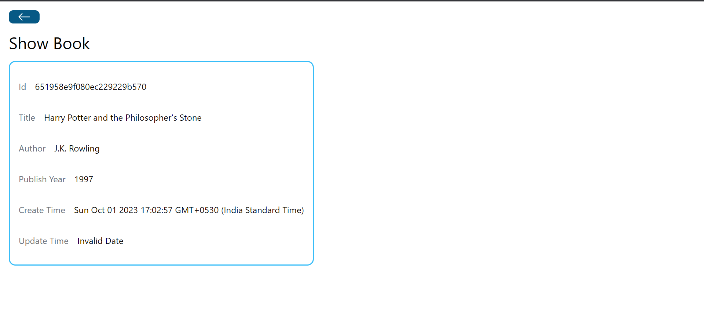
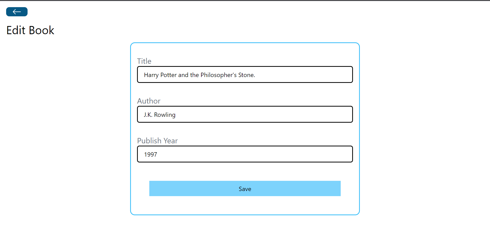
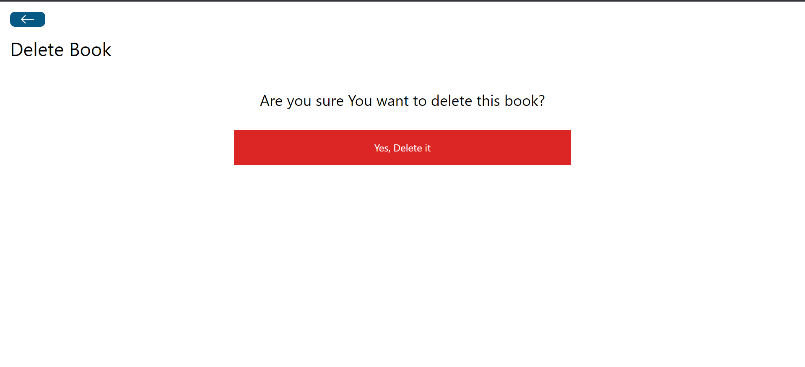

# BookWise - Your Book Management App

BookWise is a comprehensive web application designed to help you manage your book collection efficiently. It provides an intuitive interface to add, update, view, and delete books, making it easy for book enthusiasts to keep track of their reading materials.

## Features

- **Book Management:** Users can effortlessly add, update, view, and delete books from their collection.
- **Book Details:** Each book entry includes essential information such as title, author, publish year.
- **Responsive Design:** BookWise offers a responsive design for a seamless experience on various devices with the help of Tailwind CSS.
- **RESTful API:** All CRUD (Create, Read, Update, Delete) operations are accessible through a RESTful API for easy integration and customization.

## Technologies Used

BookWise is built using the following technologies:

- **Frontend:** React (Vite for rapid development), Tailwind CSS for styling.
- **Backend:** Node.js with Express.js for REST API development.
- **Database:** MongoDB for storing book information.

## Getting Started

To start using BookWise, follow these steps:

1. Clone the repository:

     ```bash
   git clone https://github.com/yourusername/bookwise.git
     ```
   
2. Install dependencies for both the frontend and backend:
     ```bash
    cd bookwise/frontend
    npm install
    cd ../backend
    npm install
    ```
3. Start the frontend and backend:
     ```bash
    # In the 'frontend' directory
    npm run dev
    
    # In the 'backend' directory
    npm start
    ```
4. Open your web browser and navigate to http://localhost:3000 to access the BookWise application.
 ## Screenshots










## Contributing

Contributions are welcome! If you have any ideas, suggestions, or bug reports, please create an issue or submit a pull request.

Before contributing, please read our [Contributing Guidelines](CONTRIBUTING.md) for more information.

## License

This project is licensed under the [MIT License](LICENSE).

## Acknowledgments

- The Expense Tracker project was inspired by the need for a simple and efficient expense management tool.
- We would like to express our gratitude to the open-source community for their contributions and support.

## Contact

If you have any questions, suggestions, or feedback, please feel free to contact the project maintainer:

- Name: Rushikesh
- GitHub: [@rushikesh5045](https://github.com/rushikesh5045)
- Email: rushikeshkadam515@gmail.com

We hope you find the Expense Tracker project useful and enjoy using it to manage your expenses effectively!

